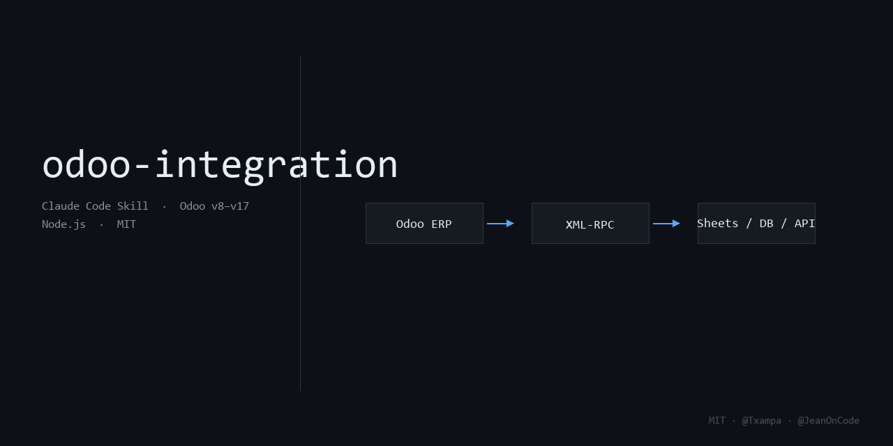

# odoo-integration



A [Claude Code](https://claude.ai/code) skill that gives Claude expert knowledge of Odoo XML-RPC integrations. Connect to any Odoo instance, query models, sync data to Google Sheets or other outputs, and deploy on Railway — without explaining the basics every time.

Works with **Odoo v8 through v17**.

---

## How it works

Install the skill once. From that point, Claude understands the full integration stack without you having to explain it:

- The XML-RPC client class and authentication flow
- Which models to query and what their fields are called
- How states differ between Odoo versions
- How to build reliable, incremental syncs with deduplication
- How to deploy on Railway with proper secret management

Just describe what you need.

```
"Sync stock.picking records in state 'waiting' to Google Sheets every 15 minutes"
"Read all confirmed sale orders from Odoo v16 and export to CSV"
"Debug why my sync stopped writing to the correct sheet tab"
"Add pagination — I have more than 100 pickings"
```

---

## Version compatibility

The XML-RPC protocol is identical across all Odoo versions. What changes is a small set of field names:

| Field | v8–v12 | v13+ |
|-------|--------|------|
| Transfer lines | `move_lines` | `move_ids` |
| Scheduled date | `min_date` | `scheduled_date` |
| Detailed operations | — | `move_line_ids` (v14+) |
| Invoice model | `account.invoice` | `account.move` |

The skill generates safe fallback patterns when the version is unknown:

```javascript
const lines = picking.move_ids || picking.move_lines || [];
const date  = picking.scheduled_date || picking.min_date;
```

---

## What's inside the skill

The skill teaches Claude to generate this project structure from scratch:

```
odoo-sync/
├── config/odoo.js        OdooClient — XML-RPC wrapper
├── utils/sync.js         SyncManager — incremental sync with dedup
├── utils/sheets.js       SheetsClient — Google Sheets output
├── index.js              Cron scheduler
├── test-odoo.js          Verify raw Odoo connection
├── debug-states.js       Inspect model states in production
├── debug-move-lines.js   Inspect lines inside a specific picking
├── .env.example
└── Procfile              Railway: web: node index.js
```

Covered in depth: `stock.picking`, `stock.move`, `sale.order`, `purchase.order`, `product.product`, `res.partner` — with states, key fields, and domain filter patterns for each.

---

## Installation

```bash
git clone https://github.com/txampa/claude-skill-odoo-integration \
  ~/.claude/skills/odoo-integration
```

Claude Code discovers skills automatically from `~/.claude/skills/`. No configuration needed. The skill activates when you mention Odoo, XML-RPC, stock.picking, ERP sync, or Railway deployment.

---

## Requirements

- [Claude Code](https://claude.ai/code)
- An Odoo instance (v8–v17) with XML-RPC enabled
- Node.js 18+ in your project
- A Google Cloud service account (only if syncing to Sheets)

---

## Credits

Created by [@Txampa](https://github.com/txampa) - JeanOnCode.

Built from a real production integration running on Odoo v8. Expanded to cover v8–v17 field differences and cross-version safe patterns.

---

## License

MIT — free to use, modify, and distribute. See [LICENSE.txt](LICENSE.txt).
